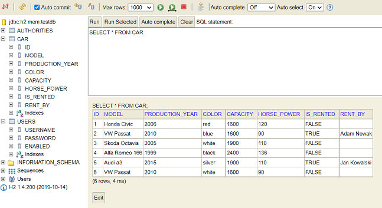
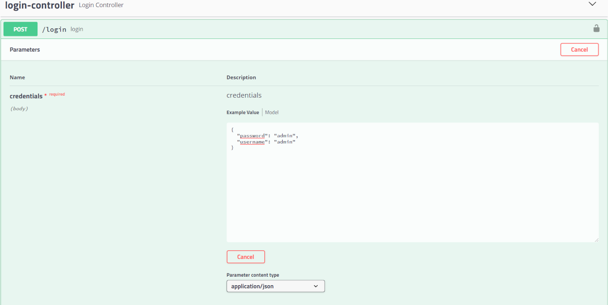

# carRental Application

## Table of contents
* [General info](#general-info)
* [Technologies](#technologies)
* [Setup](#setup)

## General info
The project is the backend of a simple car rental application (REST API).

In the application it is possible to:
- adding a new car to the offer,
- removing the car from the offer,
- editing car data (color, capacity, horse power, production year),
- car rental by the client,
- return of the rented car.

*Database used in application: H2 in-memory database*

*The project was created in the IntelliJ environment.*
	
## Technologies
Project is created with:
* Java 17
* Spring Boot 2.6.1
* swagger 2.9.2
* H2 database
* JWT authentication

## Setup

**Database structure:**
The created database is available at: http://localhost:8080/h2-console
It is presented below:

The database was filled with six exemplary vehicle offers.

**User authorization:**
The Swagger framework was used to design APi, through its use we can log the user in and authorize it.

The swagger UI is available at: http://localhost:8080/swagger-ui.html

**Login:**

User login can be done with "login-controller". The created, sample user has the following login data:
* username: admin
* password: admin

After correctly entering the data and logging in, we should receive a token (picture below):

**Authorization:**

Only authorized users can use endpoints, so the generated token should be pasted into the authorization window:

**Endpoints:**

** An example request for a car with id = 2 **

